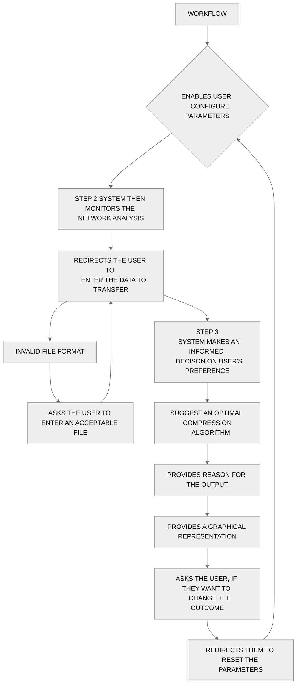

```mermaid

%%{init: {'theme':'neutral'}}%%
  
flowchart TD
    A[WORKFLOW]
    A-->B{ENABLES USER 
    CONFIGURE PARAMETERS}
    B-->M[STEP 2 SYSTEM THEN MONITORS THE NETWORK ANALYSIS]
    M-->C[REDIRECTS THE USER TO 
    ENTER THE DATA TO TRANSFER]
    C-->E[INVALID FILE FORMAT]
    E-->F[ASKS THE USER TO ENTER AN ACCEPTABLE FILE]
    F-->C
   C-->G[STEP 3
   SYSTEM MAKES AN INFORMED 
   DECISON ON USER'S PREFERENCE]
   G-->H[SUGGEST AN OPTIMAL COMPRESSION
    ALGORITHM]
    H-->I[PROVIDES REASON FOR THE OUTPUT]
    I-->J[PROVIDES A GRAPHICAL REPRESENTATION]
    J-->K[ASKS THE USER, IF THEY WANT TO 
    CHANGE THE OUTCOME]
    K-->L[REDIRECTS THEM TO RESET THE PARAMETERS]
    L-->B
```
