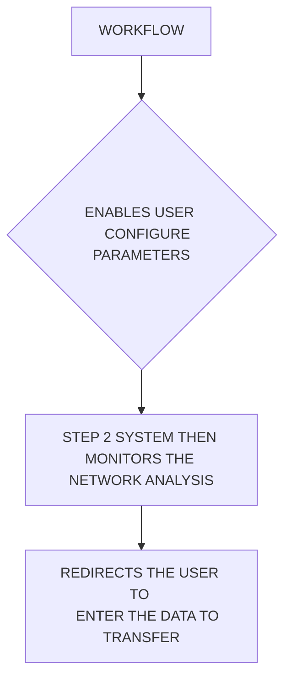

```mermaid
  
graph TD
    A[WORKFLOW];
    A-->B{ENABLES USER 
    CONFIGURE PARAMETERS};
    B-->M[STEP 2 SYSTEM THEN MONITORS THE NETWORK ANALYSIS];
    M-->C[REDIRECTS THE USER TO 
    ENTER THE DATA TO TRANSFER];
  
```
