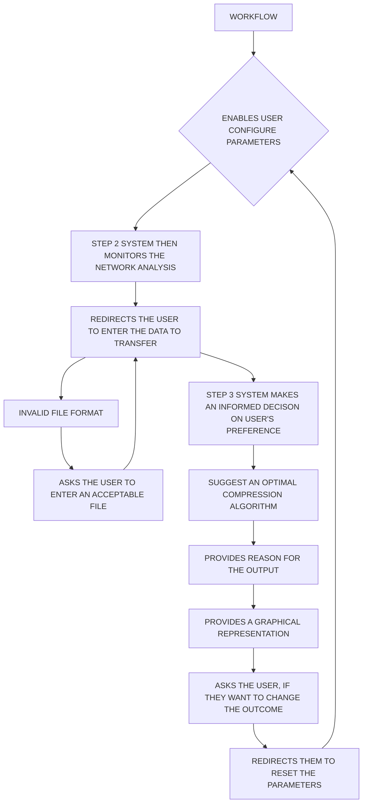

# CompMast_DEV

    
# Data Compression for Backbone Network

A Django-based web application for implementing data compression in a backbone network. This project aims to efficiently compress data, reduce network bandwidth requirements, and optimize network performance in alignment with the specific requirements and constraints of the network environment.

we are developing a tool that will efficiently recommend the data compression algorithm preferable for the user input of file type and size to be sent and his preference, ultimately optimize network performance. The software will be designed to adapt to the unique characteristics of the network environment, ensuring seamless integration and minimal disruption to existing network operations!

## Installation

### Prerequisites

- Python 3.6+
- Django 3.0+
- AWS account with necessary permissions
- Terraform installed

### Installation Steps

1. Clone the repository:

   ```shell
   git clone https://github.com/your-username/data-compression-app.git
   cd data-compression-app
   
2. Create a virtual environment and activate it:

   ```shell
   python -m venv venv
   source venv/bin/activate   # On Windows, use venv\Scripts\activate

3. Install Python dependencies:

   ```shell
   pip install -r requirements.txt

 -Configure AWS access credentials.
 
 - Set up your Django project settings for production, including database configuration, 
   static files, and media settings.
 
 - Create a GitHub Actions workflow for CI/CD deployment.

 ### Usage 
1. Create a virtual environment and activate it:

   ```shell
   python manage.py runserver

2. Access the web application at http://localhost:8000.


### Getting Started
- Clone the repository and follow the installation steps.

- Run the Django development server as mentioned in the "Usage" section.

- Customize the Django application as needed for your network environment.

### Features
- Efficient data compression for various file types.

- Reduction in network bandwidth requirements.

- Optimized network performance.

- Security measures to protect sensitive data during compression and transmission.


## Authors
- Allan Dzouza (eng21ct0002@dsu.edu.in)

- Hemal (eng21ct0009@dsu.edu.in)

- Jaice Joshep (eng21ct0011@dsu.edu.in)

- Shashank Hegde (eng21ct00036@dsu.edu.in)

- Swaroop (eng21ct00041@dsu.edu.in)

- Swathi S (eng21ct00043@dsu.edu.in)

# Flowchart

